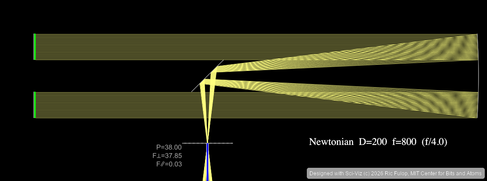
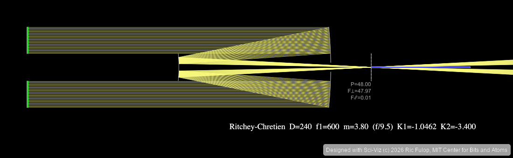
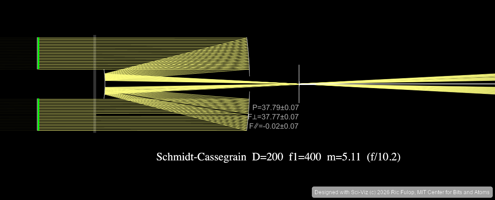
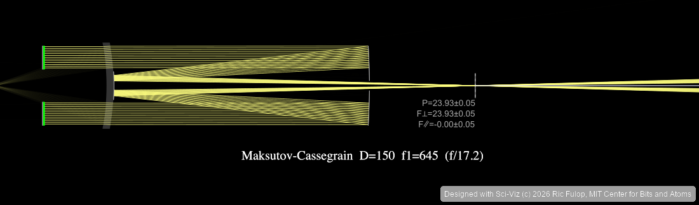
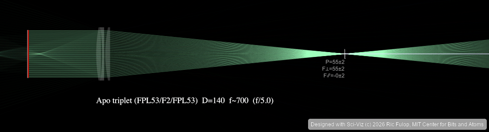
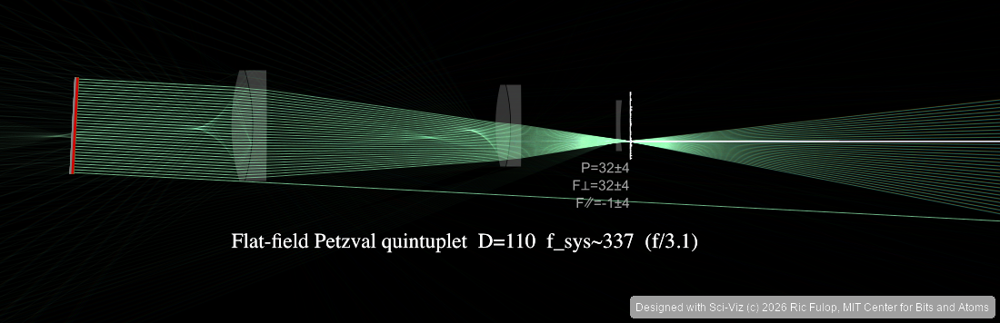

# sci-viz-mcp


**AI-controlled headless engineering and science tools.** This repo is a
collection of [MCP](https://modelcontextprotocol.io/) servers that let an AI
assistant (Cursor, Claude Desktop, Claude Code, ...) drive real
engineering software — PicoGK computational geometry, COMSOL simulation,
2D ray-optics and telescope design, physical diffraction, sequential lens
design, crystal structure visualization,
atomistic rendering, Blender 3D rendering, FreeCAD manufacturing CAD,
and PixInsight / Siril
astrophotography — and produce
publication-quality figures in APS, Nature, and Science journal styles.

## What's in the box

| Server | What it does | Engine underneath | Needs a paid license? |
|--------|--------------|-------------------|:---:|
| `picogk_mcp` | Runs trusted raw C# computational-geometry models with reproducible jobs/artifacts | PicoGK 2.2 + pinned LEAP 71 stack (.NET 9/OpenVDB) | No |
| `comsol_mcp` | Runs COMSOL models headlessly: open, parameterize, mesh, solve, export fields/KPIs | COMSOL via [mph](https://mph.readthedocs.io/) Java bridge | Yes — COMSOL |
| `comsol_viz_mcp` | Turns COMSOL field exports into APS/Nature-styled figures | matplotlib | No |
| `ray_optics_mcp` | 2D geometric optics + 18 parametric telescope designs with auto-tuned optics | vendored [ray-optics](https://github.com/ricktu288/ray-optics) (Node.js) | No |
| `physical_optics_mcp` | Scalar propagation, PSF/MTF/encircled energy, Gaussian beamlets, Jones polarization | pinned Prysm + Poke | No |
| `optical_design_mcp` | Sequential prescriptions, catalogs, ray/spot/MTF, optimization, seeded tolerancing | optional Optiland 0.6.0 | No |
| `crystal_mcp` | Crystal structures, defects, symmetry, lattice figures, TikZ export | ASE + pymatgen | No |
| `ovito_mcp` | Atomistic rendering and analysis (ray-traced) | OVITO Python API | No |
| `blender` | Photorealistic 3D rendering | Blender + official Foundation MCP server | No |
| `freecad` | Parametric CAD, STEP I/O, TechDraw manufacturing drawings, FEM | FreeCAD + [neka-nat/freecad-mcp](https://github.com/neka-nat/freecad-mcp) | No — FreeCAD is LGPL |
| `pixinsight_mcp` | Astrophotography processing (gradients, color, stretch, deconvolution, LRGB) | PixInsight PJSR bridge (vendored, MIT) | Yes — PixInsight + RC Astro plugins |
| `siril_mcp` | Astrophotography processing + stacking (calibrate/register/stack, gradients, SPCC, stretch, denoise) | [Siril](https://siril.org) headless `siril-cli` | No — Siril is GPLv3 |

Cross-cutting pieces:

- **`styles.py`** — APS / Nature / Science rcParams, Okabe-Ito colors,
  journal column widths. The canonical figure-style source for all
  Voltivity repos.
- **Python physical-optics server** — `physical_optics_mcp` uses pinned
  [Prysm](https://github.com/brandondube/prysm) for diffraction and
  wavefront propagation plus [Poke](https://github.com/Jashcraf/poke) for
  Gaussian beamlets and Jones polarization. Native tools do not require
  Zemax/CODE V; Poke's licensed adapters are optional and health reports
  them unavailable when absent.
- **Optional astronomy and optical-design stacks** — `--with-astro`
  installs Astropy, POPPY, AOtools, and HCIPy; `--with-design` installs
  Optiland for `optical_design_mcp`. These cover FITS/WCS/units,
  astronomical diffraction, atmosphere/adaptive-optics simulation, and
  sequential lens optimization/tolerancing, respectively.
- **Live preview dashboard** — every render from any server streams to a
  browser dashboard at [http://localhost:8765](http://localhost:8765).
- **Attribution stamping** — outputs carry `Designed with Sci-Viz (c) 2026
  Ric Fulop, MIT Center for Bits and Atoms` in metadata and, where
  supported, as a small visual footer. Disable with `SCIVIZ_ATTRIBUTION=0`
  for camera-ready figures.

## Licensing at a glance

Everything in this repo is open source or builds on open source — see
[`THIRD_PARTY_NOTICES.md`](THIRD_PARTY_NOTICES.md) for the full list of
vendored code and library licenses. Two integrations drive **commercial
software you must license yourself**:

- **COMSOL Multiphysics** — required for `comsol_mcp` solver tools.
  Visualizing exported fields with `comsol_viz_mcp` works without it.
- **PixInsight and the RC Astro plugins** (BlurXTerminator,
  NoiseXTerminator, StarXTerminator) — required for `pixinsight_mcp`. The
  bridge executes inside a running licensed PixInsight instance, and its
  sharpening/denoise/star-removal workflows assume the RC Astro plugins
  are installed. Details in
  [`pixinsight_mcp/README_SCIVIZ.md`](pixinsight_mcp/README_SCIVIZ.md).

Poke also has optional adapters for **Zemax OpticStudio** and **CODE V**.
`physical_optics_mcp` does not require either application: its native Prysm
and Poke tools remain available, while health reports licensed adapters
unavailable when those applications are absent.

## Quick start

```bash
git clone <this repo> && cd sci-viz-mcp

./install.sh              # python venv + deps + node builds
# or ./install.sh --minimal
# or ./install.sh --with-picogk --sync-picogk
# or ./install.sh --minimal --with-astro --with-design
```

Then generate the MCP registration for your machine (absolute paths filled
in automatically) and restart your MCP client:

```bash
.venv/bin/python scripts/generate_mcp_config.py            # print JSON to paste
.venv/bin/python scripts/generate_mcp_config.py --write    # or merge into ~/.cursor/mcp.json
```

Prerequisites: Python ≥ 3.10, Node.js ≥ 18 (for the ray-optics and
PixInsight servers), and optionally .NET 9 / COMSOL / PixInsight / Blender
for the servers that drive them. PicoGK 2.2 native execution supports
macOS ARM64 and Windows x64.

Regenerate the repo hero graphic with GPT Image when `OPENAI_API_KEY` is available:

```bash
python3 scripts/generate_repo_graphic_gpt_image.py \
  --model gpt-image-2 \
  --prompt assets/sci-viz-mcp-hero-white.prompt.md \
  --output assets/sci-viz-mcp-hero-white.png
```

## Architecture

```
Cursor IDE (any chat, any repo)
  │
  ├── picogk_mcp ───── Python broker ───── isolated .NET 9 / PicoGK jobs
  │                    + locked source       STL/OBJ/VDB/images + provenance
  ├── comsol_mcp ───── mph (Java API) ──── open/solve/export COMSOL models
  ├── comsol_viz_mcp ─ matplotlib ──────── COMSOL field maps, line cuts
  ├── ray_optics_mcp ─ ray-optics engine ─ 2D optical design, telescope
  │                    (Node.js, vendored)   presets, ray-traced spot metrics
  ├── physical_optics_mcp ─ Prysm + Poke ─ scalar diffraction, PSF/MTF,
  │                                        beamlets, Jones polarization
  ├── optical_design_mcp ─ Optiland ────── sequential prescriptions,
  │                                        optimization, seeded tolerancing
  ├── crystal_mcp ──── ASE + pymatgen ──── lattice diagrams, TikZ, defects
  ├── ovito_mcp ────── OVITO Python API ── atomistic rendering (Tachyon)
  ├── blender ──────── official Blender ── stdio MCP ⇄ TCP :9876 ⇄ Blender
  │                    Foundation MCP        add-on (sciviz_blender_addon
  │                    server                registers bpy.ops.sciviz.*)
  ├── freecad ──────── neka-nat freecad-mcp  stdio MCP ⇄ XML-RPC :9875 ⇄ FreeCAD
  │                    (uvx) + FreeCADMCP      TechDraw / Part / FEM / STEP
  │                    addon (vendored)
  ├── pixinsight_mcp ─ PixInsight PJSR ─── astrophotography processing via
  │                    file IPC bridge       AI-driven MCP tools
  ├── siril_mcp ────── siril-cli scripts ── free astrophotography stacking
  │                    (headless, GPLv3)     + processing (Siril 1.4)
  │
  ├── styles.py ────── APS / Nature / Science rcParams, Okabe-Ito, column widths
  └── science-figure-style/ ── AAAS figure spec (SKILL.md) + example_figure.py
```

All servers are registered globally in `~/.cursor/mcp.json` and available in every Cursor chat regardless of workspace.

## Servers

### picogk_mcp (17 tools)
Full programmatic access to PicoGK 2.2 and the public LEAP 71
computational-engineering stack. Models are trusted raw C# tasks compiled
against exact locked revisions of ShapeKernel, LatticeLibrary,
QuasiCrystals, RoverWheel, HelixHeatX, and the official examples. Every run
is isolated in a child process and records source/dependency hashes, voxel
size, logs, timings, and artifact checksums.

**Full manual:** [`picogk_mcp/README_SCIVIZ.md`](picogk_mcp/README_SCIVIZ.md)

| Tool group | Tools |
|------------|-------|
| Environment | `picogk_health`, `picogk_stack_info`, `picogk_sync_stack`, `picogk_reference` |
| Projects | `picogk_create_project`, `picogk_list_projects`, `picogk_get_project`, `picogk_write_source` |
| Build/run | `picogk_build`, `picogk_run`, `picogk_run_csharp` |
| Jobs | `picogk_job_status`, `picogk_list_jobs`, `picogk_cancel_job`, `picogk_job_logs` |
| Artifacts | `picogk_list_artifacts`, `picogk_preview_artifact` |

> `picogk_run_csharp` executes trusted local code with the MCP server user's
> filesystem/network permissions. Process isolation and timeouts are not an
> operating-system sandbox.

### comsol_mcp (15 tools)
Headless COMSOL execution via `mph` (Java API). Ported from the
Flash-Physics-Twin project's comprehensive execution server and
generalized: the runs directory is configurable (`COMSOL_MCP_RUNS_DIR`),
and the coupled EM + thermal + Flash physics exports are exposed as tools.

**Full manual:** [`comsol_mcp/README_SCIVIZ.md`](comsol_mcp/README_SCIVIZ.md)

| Tool | Description |
|------|-------------|
| `comsol_health` | mph install + template check (`start_client=true` launches COMSOL) |
| `comsol_open_or_create_model` | Open `.mph` or copy template into run dir |
| `comsol_apply_inputs` | Apply YAML inputs from run directory |
| `comsol_build_geometry` / `comsol_mesh` | Geometry and mesh |
| `comsol_run_pipeline` / `comsol_run_study` | Execute studies |
| `comsol_export_fields` / `comsol_export_kpis` | HDF5 + JSON outputs (incl. Flash ΔB/χ) |
| `comsol_export_em_coil_fields` / `comsol_export_em_coil_kpis` | AC/DC coil EM surrogate |
| `comsol_export_coupled_fields` / `comsol_export_coupled_kpis` | Coupled EM + thermal + Flash |
| `comsol_render_png` / `comsol_close_model` | Plot export and cleanup |

**Common failure:** a `.mph` that is a text placeholder, not a binary
COMSOL model. Save a real `.mph` from COMSOL Desktop and pass
`model_path`, or set `COMSOL_MCP_DEFAULT_TEMPLATE` in `mcp.json`.

### comsol_viz_mcp (7 tools)
Publication-quality visualization of COMSOL field exports. Works without
a COMSOL license — it only reads exported HDF5/CSV files.

| Tool | Description |
|------|-------------|
| `comsol_viz_health` | Matplotlib/output-dir readiness check |
| `comsol_viz_load_field` | Load HDF5/CSV field data from COMSOL exports |
| `comsol_viz_render_field_map` | 2D field map (temperature, E-field, etc.) |
| `comsol_viz_render_line_cut` | 1D line cut through field data |
| `comsol_viz_render_mesh` | Mesh visualization |
| `comsol_viz_list_datasets` | List loaded field datasets |
| `comsol_viz_get_field_stats` | Min/max/mean of field data |

### ray_optics_mcp (14 tools)
AI-driven 2D geometric optics on the vendored [ray-optics](https://github.com/ricktu288/ray-optics) engine (Node.js, headless). Scene JSON is fully compatible with the [web simulator](https://phydemo.app/ray-optics/simulator/), so scenes can be hand-edited there and reloaded.

**Full manual:** [`ray_optics_mcp/TELESCOPE_DESIGN_MANUAL.md`](ray_optics_mcp/TELESCOPE_DESIGN_MANUAL.md) — conventions, all presets with prescriptions, spot metrics, auto-tuning internals, engine gotchas, and how to add new designs.

| Tool | Description |
|------|-------------|
| `ray_optics_new_scene` / `ray_optics_load_scene` / `ray_optics_save_scene` | Create, load, persist scene JSON |
| `ray_optics_get_scene` / `ray_optics_list_scenes` / `ray_optics_list_objects` | Inspect scenes and objects |
| `ray_optics_add_objects` / `ray_optics_update_object` / `ray_optics_remove_objects` | Edit any engine object (mirrors, glass, lenses, detectors, …) |
| `ray_optics_set_scene_settings` | Ray density, chromatic simulation, viewport |
| `ray_optics_simulate` | Detector readings: power + 1D irradiance map (spot profiles) |
| `ray_optics_render` | Auto-framed PNG render (streams to the live preview dashboard) |
| `ray_optics_make_telescope` | Parametric telescope presets — 18 designs, see below |
| `ray_optics_reference` | Engine object/format documentation |

**Telescope preset library (18 designs, correct conic/glass prescriptions):**

| Family | Designs |
|--------|---------|
| Reflectors | `newtonian`, `prime_focus`, `herschelian` (off-axis, unobstructed), `cassegrain` (classical), `ritchey_chretien` (aplanatic), `dall_kirkham`, `gregorian`, `nasmyth` |
| Catadioptrics (auto-tuned) | `schmidt_camera`, `schmidt_cassegrain`, `maksutov_cassegrain` (Gregory spot) |
| Refractors | `keplerian_refractor`, `galilean_refractor`, `singlet_refractor` (chromatic demo), `achromat_doublet` (BK7+F2), `petzval_refractor`, `apo_triplet` (FPL53 ED, bendings auto-tuned), `flatfield_petzval` (quadruplet/quintuplet, tuned for flat-plane spot on- and off-axis) |

**Gallery** (rendered by `scripts/generate_telescope_gallery.py` straight from the presets):

| | |
|---|---|
|  |  |
| Newtonian D=200 f/4 | Ritchey-Chrétien D=240 f/9.5 |
|  |  |
| Schmidt-Cassegrain D=200 (auto-tuned corrector) | Maksutov-Cassegrain D=150 f/17 (auto-tuned meniscus) |
|  |  |
| Apo triplet FPL53/F2/FPL53 D=140 f/5, chromatic trace | Flat-field Petzval quintuplet D=110 f/3.1, chromatic trace |

Highlights:
- **Engine-in-the-loop auto-tuning** — Schmidt corrector strengths, Maksutov meniscus radii, apo-triplet element bendings, and Petzval field flatteners are optimized by minimizing the ray-traced RMS spot (golden-section / coordinate descent), not by closed-form guesses.
- **Physical chromatic model** — two-term Cauchy dispersion with a BK7/F2/FPL53 glass table; `chromatic: true` traces RGB wavelengths.
- **Off-axis analysis** — `field_angle_deg` tilts the incoming beam to expose coma and field curvature (e.g. classical Cassegrain vs Ritchey-Chrétien).
- **Quantitative spot metrics** — full-map and 90%-energy clipped RMS from detector irradiance maps.

```bash
# Smoke tests
cd ray_optics_mcp
python3 validate_designs.py   # traces all 18 presets, power + RMS report
python3 test_e2e.py           # full MCP round-trip incl. renders
```

### physical_optics_mcp (19 tools)

Unit-safe, persistent physical-optics models using the repository-pinned
Prysm and Poke revisions. Prysm provides scalar pupil wavefronts, FFT focus,
angular-spectrum propagation, PSF, and MTF. Poke provides Gaussian beamlet
initialization/ABCD complex-curvature propagation and Fresnel/Jones
polarization analysis.

**Full manual:** [`physical_optics_mcp/README_SCIVIZ.md`](physical_optics_mcp/README_SCIVIZ.md)

| Tool group | Tools |
|---|---|
| Environment | `physical_optics_health`, `physical_optics_reference` |
| Models | `physical_optics_new_model`, `physical_optics_load_model`, `physical_optics_save_model`, `physical_optics_list_models`, `physical_optics_get_model` |
| Definition | `physical_optics_define_pupil`, `physical_optics_define_wavelengths_fields`, `physical_optics_set_aberrations` |
| Scalar analysis | `physical_optics_wavefront`, `physical_optics_propagate`, `physical_optics_psf`, `physical_optics_mtf`, `physical_optics_encircled_energy` |
| Beam/polarization | `physical_optics_gaussian_beamlets`, `physical_optics_polarization_jones` |
| Output | `physical_optics_render`, `physical_optics_export` |

Models use mm for pupil/focal distances, nm for wavelengths/WFE, degrees for
fields, µm for PSF radii, and cycles/mm for MTF. Artifact names are stable
SHA-256 functions of model and operation inputs.

The pinned Prysm revision has no encircled-energy helper, so the server
integrates the normalized Prysm PSF directly and documents that narrow
fallback. Poke's Zemax/CODE V adapters are optional; the native beamlet/Jones
tools require neither commercial application and health reports adapter
availability explicitly.

### optical_design_mcp (21 tools)

Sequential optical design through optional `optiland==0.6.0`: persistent
explicit-unit prescriptions, glass catalog access, real-ray tracing, spot
diagrams, geometric/FFT MTF, deterministic optimization, and seeded Monte
Carlo tolerancing.

**Full manual:** [`optical_design_mcp/README_SCIVIZ.md`](optical_design_mcp/README_SCIVIZ.md)

| Tool group | Tools |
|---|---|
| Environment | `optical_design_health`, `optical_design_reference` |
| Models | `optical_design_new_model`, `optical_design_load_model`, `optical_design_save_model`, `optical_design_list_models`, `optical_design_get_model` |
| Prescription | `optical_design_add_surface`, `optical_design_update_surface`, `optical_design_remove_surface`, `optical_design_set_aperture_stop`, `optical_design_set_fields`, `optical_design_set_wavelengths` |
| Catalog/analysis | `optical_design_materials`, `optical_design_trace`, `optical_design_spot`, `optical_design_mtf` |
| Design/output | `optical_design_optimize`, `optical_design_tolerance`, `optical_design_render`, `optical_design_export` |

Install with `./install.sh --with-design`. Without Optiland, the server still
starts and supports model editing; engine-backed tools return a structured
`ENGINE_UNAVAILABLE` error. Radius/thickness/aperture/spot values are mm,
angular fields are degrees, wavelengths enter as nm, and MTF is cycles/mm.

```bash
MPLBACKEND=Agg .venv/bin/python -m pytest -q \
  tests/test_physical_optics_mcp.py tests/test_optical_design_mcp.py
```

### crystal_mcp (9 tools)
Replaces VESTA with a programmatic, reproducible workflow.

| Tool | Description |
|------|-------------|
| `crystal_import_structure` | Load CIF, POSCAR, XYZ |
| `crystal_build_supercell` | Build NxMxL supercell |
| `crystal_create_defect` | Vacancy, substitution, interstitial |
| `crystal_get_symmetry` | Space group, Wyckoff positions |
| `crystal_render_lattice` | 2D projection → PDF/PNG/SVG |
| `crystal_render_unit_cell` | Annotated unit cell with bond lengths |
| `crystal_compare_structures` | Side-by-side structural comparison |
| `crystal_export_tikz` | LaTeX-ready TikZ code |
| `crystal_list_structures` | Show loaded structures |

### ovito_mcp (9 tools)
Headless atomistic visualization via OVITO Python API.

| Tool | Description |
|------|-------------|
| `ovito_import_data` | Load CIF, LAMMPS, POSCAR, XYZ, GSD |
| `ovito_add_modifier` | Coordination, Voronoi, CNA, color coding, etc. |
| `ovito_set_visual_style` | Particle colors, radii, cell visibility |
| `ovito_set_camera` | Ortho/perspective, direction, FOV |
| `ovito_render_image` | Tachyon ray-traced PNG/TIFF |
| `ovito_render_animation` | Frame sequence for simulations |
| `ovito_compute_property` | Extract RDF, coordination, per-atom data |
| `ovito_pipeline_status` | Inspect pipeline state |
| `ovito_list_pipelines` | List active pipelines |

### blender (official Blender Foundation MCP server + SciViz add-on)
Photorealistic 3D rendering via Blender + Cycles. Uses the
[official Blender Foundation MCP server](https://www.blender.org/lab/mcp-server/)
released by the Blender devs in partnership with Anthropic.

```
Cursor ──MCP/stdio──▶ blender-mcp ──TCP :9876──▶ Blender (5.1+)
                                                  ├── Foundation MCP add-on (transport)
                                                  └── SciViz add-on (sciviz_blender_addon/)
                                                        registers bpy.ops.sciviz.*
```

Science vocabulary lives inside Blender as proper operators, so it persists
across sessions, shows up as buttons in the SciViz N-panel, and is callable
from any MCP client by writing one-line Python through the Foundation
server's execute-Python surface.

**SciViz operators (registered by `sciviz_blender_addon/`):**

| Operator | Description |
|----------|-------------|
| `bpy.ops.sciviz.import_crystal(filepath=...)` | CIF / POSCAR / XYZ → ball-and-stick with CPK materials. Uses ASE if installed in Blender's Python, falls back to pymatgen. |
| `bpy.ops.sciviz.apply_preset(preset=...)` | `WHITE_CLEAN` / `SOFT_SHADOW` / `PERSPECTIVE_DEPTH` / `DARK_PRESENTATION` |
| `bpy.ops.sciviz.render_hq(filepath=..., width=..., height=..., samples=...)` | Cycles render with 16-bit PNG output and live-preview ping |
| `bpy.ops.sciviz.add_annotation_3d(text=..., location_x=..., ...)` | 3D text label, optionally parented to the Crystal collection |

**Setup (one-time):**

```bash
# 1. Install the Foundation MCP add-on inside Blender 5.1+.
#    Open https://www.blender.org/lab/mcp-server/ and drag the install
#    link into Blender twice: first adds the lab.blender.org repository,
#    second installs the add-on. Enable it in Edit > Preferences > Add-ons.

# 2. Install the Foundation MCP *server* (the stdio bridge between
#    Cursor and Blender). Clones the source repo and pip-installs into
#    ./blender_mcp_foundation/.venv .
cd sci-viz-mcp
./install_blender_foundation_mcp.sh

# 3. Install the SciViz add-on into Blender's user extensions
./install_sciviz_addon.sh                 # symlink (live editing)
# or  ./install_sciviz_addon.sh --copy     # one-shot copy

# 4. ASE / numpy in Blender's bundled Python (one-time)
/Applications/Blender.app/Contents/Resources/5.1/python/bin/python3.* \
    -m pip install ase numpy

# 5. Drop the snippet from step 2 into ~/.cursor/mcp.json under the
#    `blender` key, then reload Cursor's MCP servers.

# 6. In Blender, the BlenderMCP sidebar tab (View3D > N) shows a
#    "Connect" / status indicator. Once connected, calls from Cursor
#    flow through the Foundation server into Blender's bpy.
```

Both server and add-on come from the Blender Foundation, so the protocol
matches end-to-end. The community `uvx blender-mcp` (ahujasid) used to
work in earlier setups but its command vocabulary disagrees with the
Foundation add-on's, so don't mix them.

### freecad (neka-nat FreeCAD MCP + vendored FreeCADMCP addon)
Parametric CAD control via FreeCAD: Part primitives, STEP import/export,
TechDraw manufacturing drawings, parts library, and CalculiX FEM. Uses
[`neka-nat/freecad-mcp`](https://github.com/neka-nat/freecad-mcp) (MIT) —
the mature community FreeCAD MCP (~1.3k stars). Same transport shape as
Blender: stdio bridge ↔ localhost RPC ↔ GUI app.

```
Cursor ──MCP/stdio──▶ uvx freecad-mcp ──XML-RPC :9875──▶ FreeCAD (1.0+)
                                                          └── FreeCADMCP addon
                                                                (freecad_mcp/addon/)
```

**Full manual:** [`freecad_mcp/README_SCIVIZ.md`](freecad_mcp/README_SCIVIZ.md)

| Tool | Description |
|------|-------------|
| `create_document` / `get_objects` / `get_object` | Document + object inspection |
| `create_object` / `edit_object` / `delete_object` | Part primitives and edits |
| `execute_code` | Full FreeCAD Python (`Part`, `TechDraw`, `Import`, …) |
| `get_view` | Active-viewport screenshot |
| `insert_part_from_library` / `get_parts_list` | FreeCAD parts library |
| `run_fem_analysis` | CalculiX FEM summary |

**Setup (one-time):**

```bash
brew install --cask freecad          # FreeCAD 1.1+
cd sci-viz-mcp
./install_freecad_mcp.sh             # symlink freecad_mcp/addon → FreeCAD Mod
.venv/bin/python scripts/generate_mcp_config.py --servers freecad --write
# Restart FreeCAD → Workbench "MCP Addon" → Start RPC Server (or Auto-Start)
# Reload MCP servers in Cursor
```

Manufacturing drawings from STEP: import the part, then drive TechDraw
through `execute_code` (page + orthographic views + DXF/SVG/PDF export).

### pixinsight_mcp (18 tools, vendored)
AI-driven PixInsight control for astrophotography processing, vendored from
[`aescaffre/pixinsight-mcp`](https://github.com/aescaffre/pixinsight-mcp)
(MIT license). PixInsight has no HTTP/socket API, so this bridge uses
file-based IPC: the MCP server writes JSON commands under
`~/.pixinsight-mcp/bridge/commands/`, while
`pixinsight_mcp/pjsr/pixinsight-mcp-watcher.js` runs inside PixInsight and
writes results back.

> **Licensing:** requires a paid [PixInsight](https://pixinsight.com/)
> license, and the deconvolution/denoise/star-removal workflows assume
> the commercial [RC Astro](https://www.rc-astro.com/) plugins
> (BlurXTerminator, NoiseXTerminator, StarXTerminator) are installed in
> PixInsight. Neither is bundled here.

**Full setup/manual:** [`pixinsight_mcp/README_SCIVIZ.md`](pixinsight_mcp/README_SCIVIZ.md).

| Tool group | Tools |
|------------|-------|
| Image/session management | `list_open_images`, `open_image`, `save_image`, `close_image`, `get_image_statistics` |
| Core processing | `run_pixelmath`, `remove_gradient`, `color_calibrate`, `remove_green_cast`, `stretch_image`, `apply_curves`, `denoise`, `sharpen`, `deconvolve` |
| Composition | `combine_lrgb`, `blend_narrowband` |
| Knowledge | `search_processing_recommendations` |

```bash
cd pixinsight_mcp
npm install
npm run build
npm run setup-bridge
# In PixInsight: Script -> Run Script... -> pjsr/pixinsight-mcp-watcher.js
```

### siril_mcp (15 tools)
The free counterpart to `pixinsight_mcp`: AI-driven
[Siril](https://siril.org) control, following the same processing workflow.
Siril has first-class headless automation, so this server just generates
Siril scripts and runs them with `siril-cli` — no GUI, no watcher process,
and no paid license (Siril is GPLv3). It also covers what the PixInsight
bridge doesn't: full preprocessing (calibrate / register / stack) of raw
light frames.

**Full setup/manual:** [`siril_mcp/README_SCIVIZ.md`](siril_mcp/README_SCIVIZ.md).

| Tool group | Tools |
|------------|-------|
| Setup/session | `siril_check`, `siril_open_image`, `siril_list_sessions`, `siril_get_statistics` |
| Processing | `siril_remove_gradient`, `siril_color_calibrate`, `siril_deconvolve`, `siril_stretch`, `siril_remove_green`, `siril_denoise`, `siril_crop`, `siril_run_commands` |
| Stacking | `siril_preprocess_stack` (convert → calibrate → debayer → register → stack) |
| Export/knowledge | `siril_save_image`, `siril_workflow` |

Requires Siril ≥ 1.2 installed (auto-detected on macOS; else set `SIRIL_CLI`).

## Live Preview Dashboard

Every render from any MCP server (crystal, OVITO, Blender, COMSOL, ray
optics, physical optics, or sequential optical design) appears in a
browser-based live preview dashboard in real time.

```
MCP servers ──POST /api/render──▶ preview server ──WebSocket──▶ browser dashboard
```

**Auto-launch:** The first time any MCP tool produces a render, the preview
server starts automatically and opens your browser. No manual setup needed.

**Manual launch:** Or start it yourself:

```bash
cd sci-viz-mcp
source .venv/bin/activate
python -m preview.server
```

Dashboard → [http://localhost:8765](http://localhost:8765)

Features:
- Real-time image/PDF preview as renders complete
- History strip with thumbnails — click to revisit any render
- Metadata panel showing tool name, server, parameters, and file path
- Keyboard navigation: `←` / `→` to browse history, `Space` to jump to latest
- Auto-reconnecting WebSocket — survives network hiccups

## Figure Styles

```python
from styles import (
    apply_aps_style, apply_nature_style, apply_science_style,
    OKABE_ITO, aps_double, nature_single, science_double,
    label_science_panel, save_science_figure,
)

apply_aps_style()                    # PRL/PRX/PRB: serif, 10pt, inward ticks, 600 DPI
apply_nature_style()                 # Nature/NatComms: sans-serif, 7pt, outward ticks, 300 DPI
apply_science_style()                # Science/AAAS: sans-serif, 7pt, no minor ticks, 300 DPI
apply_aps_style(use_latex=True)      # LaTeX + Computer Modern
apply_aps_large_style()              # 22pt for 0.48\textwidth panels

fig, ax = plt.subplots(figsize=aps_double())       # 6.75 x 3.2 in
fig, ax = plt.subplots(figsize=nature_single())      # 3.5 x 2.625 in (89 mm)
fig, ax = plt.subplots(figsize=science_double())     # 4.76 x 3.0 in (12.1 cm)
```

Science figure guide: `science-figure-style/SKILL.md`. Example: `python science-figure-style/example_figure.py`.

## Full Pipeline (COMSOL → figure)

```
comsol_mcp                         comsol_viz_mcp
──────────                         ──────────────
comsol_open_or_create_model  ──┐
comsol_apply_inputs            │
comsol_run_study               │
comsol_export_fields ──────────┼──→ comsol_viz_load_field
                               │    comsol_viz_render_field_map (APS/Nature style)
comsol_export_kpis ────────────┘    comsol_viz_render_line_cut
```

**Troubleshooting**

| Symptom | Likely cause | Fix |
|---------|----------------|-----|
| MCP server red / JSON parse errors on `comsol_viz_mcp` | Matplotlib wrote warnings to stdout | Reload MCP after update; `MPLCONFIGDIR` is set in `mcp.json` |
| `model file is damaged or not valid` | Placeholder `.mph` in repo | Use `comsol_health` then pass `model_path` to a real binary `.mph` |
| `mph not installed` | Wrong Python venv | `pip install mph h5py pyyaml` into `.venv` referenced by `mcp.json` |
| Viz works, solve does not | COMSOL not licensed / not running | Call `comsol_health` with `start_client: true` |
| Tools filtered / naming warnings in Cursor | Dotted names (`comsol.mesh`) | Reload MCP — tools now use underscores (`comsol_mesh`) |
| PixInsight tools time out | Watcher script not running in PixInsight | Script → Run Script… → `pjsr/pixinsight-mcp-watcher.js` |

```bash
# Quick smoke tests
.venv/bin/python tests/test_comsol_viz.py
```

## License & Contributing

The code in this repo is [MIT-licensed](LICENSE). Vendored components keep
their own licenses (see below). Contributions welcome — see
[`CONTRIBUTING.md`](CONTRIBUTING.md) for the repo layout, conventions, and
test commands.

## Attribution & Third-Party Software

- Outputs are stamped `Designed with Sci-Viz (c) 2026 Ric Fulop, MIT
  Center for Bits and Atoms` (metadata always; visual footer where the
  format supports it). Set `SCIVIZ_ATTRIBUTION=0` to suppress the footer.
- Everything this repo vendors or builds on is credited in
  [`THIRD_PARTY_NOTICES.md`](THIRD_PARTY_NOTICES.md) — ray-optics
  (Apache-2.0), pixinsight-mcp (MIT), PicoGK and the LEAP 71 libraries,
  ASE, pymatgen, OVITO, Blender, matplotlib, mph, and the commercial
  applications (COMSOL, PixInsight, RC Astro) that you must license
  yourself.

## Benchmark: Highly-Cited Crystal Structure Figures

Design conventions extracted from the most-cited papers using lattice structure figures, identified via [scite.ai](https://scite.ai) Smart Citation analysis.

### Reference papers

| Citations | Paper | Journal | Figure techniques |
|-----------|-------|---------|-------------------|
| 23,838 | Momma & Izumi, [VESTA 3](https://doi.org/10.1107/s0021889811038970) (2011) | J. Appl. Crystallogr. | Polyhedral + ball-and-stick hybrid, thermal ellipsoids, isosurfaces — the standard |
| 2,663 | Saparov & Mitzi, [Organic-Inorganic Perovskites](https://doi.org/10.1021/acs.chemrev.5b00715) (2016) | Chem. Rev. | Skeletal + polyhedral combined views, dimensionality slicing schematics |
| 2,327 | Adler, [SOFC Cathodes](https://doi.org/10.1021/cr020724o) (2004) | Chem. Rev. | Polyhedral + vacancy hopping arrows overlaid on structure |
| 1,410 | Zheng et al., [Nanostructured WO₃](https://doi.org/10.1002/adfm.201002477) (2011) | Adv. Funct. Mater. | Polyhedral tilt representations for 6 crystal phases, phase transformation sequences |
| 1,077 | Tsunekawa et al., [CeO₂ nanocrystals](https://doi.org/10.1063/1.2061873) (2005) | Appl. Phys. Lett. | Fluorite lattice parameter vs. size with structural schematic |
| 1,044 | Volonakis et al., [Cs₂InAgCl₆](https://doi.org/10.1021/acs.jpclett.6b02682) (2017) | JPCL | Ball-and-stick Fm-3m with alternating octahedra, widely reproduced |
| 1,018 | Adachi & Imanaka, [Binary Rare Earth Oxides](https://doi.org/10.1021/cr940055h) (1998) | Chem. Rev. | Fluorite vacancy superstructure + diffraction evidence |
| 882 | Li et al., [Na₀.₅Bi₀.₅TiO₃](https://doi.org/10.1038/nmat3782) (2013) | Nature Mater. | Side-by-side parent/child phases, vacancy channels, + electron diffraction |
| 647 | Foster et al., [Vacancies in hafnia](https://doi.org/10.1103/physrevb.65.174117) (2002) | Phys. Rev. B | Defect site ball-and-stick with charge density overlay |

### Key conventions from highly-cited papers

| Convention | Description | Implemented? |
|------------|-------------|:---:|
| Polyhedral + ball hybrid | Show coordination polyhedra AND individual atoms | Planned |
| Phase transformation arrows | Side-by-side parent → child with bold arrow | Yes |
| Vacancy channels colored | Highlight vacancy-rich planes in a distinct color | Yes |
| Diffraction evidence inset | Small SAED/XRD pattern proving structural claim | Yes |
| Bond-length annotations | Explicit angstrom values on key bonds | Yes |
| Color-coded Wyckoff sites | Different colors per crystallographic site | Planned |
| 3D perspective with depth | Slight perspective or isometric view showing 3D character | Planned |
| Derivation box | Math box showing key calculation leading to prediction | Yes |

## Sample Structures

- `tests/sample_structures/fluorite_ZrO2.cif` — Fm-3m (#225), a = 5.145 Å
- `tests/sample_structures/rocksalt_ZrO.cif` — Fm-3m (#225), a = 4.620 Å
