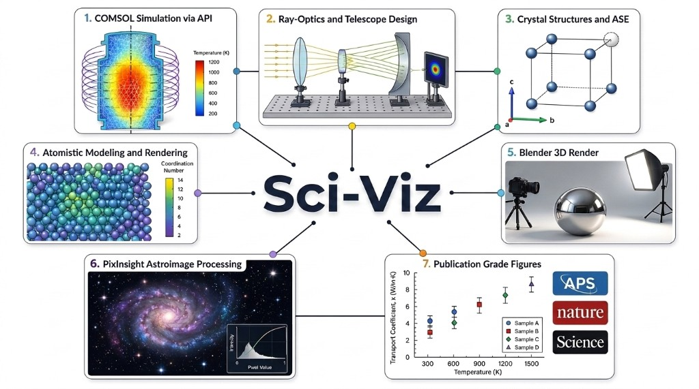

# sci-viz-mcp



MCP servers for scientific visualization and simulation — crystal structures, atomistic rendering, 3D rendering, COMSOL field visualization, 2D ray-optics / telescope design, and PixInsight astrophotography processing — with APS, Nature, and Science journal figure styles.

```

## Architecture

```
Cursor IDE (any chat, any repo)
  │
  ├── crystal_mcp ──── ASE + pymatgen ──── lattice diagrams, TikZ, defects
  ├── ovito_mcp ────── OVITO Python API ── atomistic rendering (Tachyon)
  ├── blender ──────── official Blender ── stdio MCP ⇄ TCP :9876 ⇄ Blender
  │                    Foundation MCP        add-on (sciviz_blender_addon
  │                    server                registers bpy.ops.sciviz.*)
  ├── comsol_viz_mcp ─ matplotlib ──────── COMSOL field maps, line cuts
  ├── ray_optics_mcp ─ ray-optics engine ─ 2D optical design, telescope
  │                    (Node.js, vendored)   presets, ray-traced spot metrics
  ├── pixinsight_mcp ─ PixInsight PJSR ─── astrophotography processing via
  │                    file IPC bridge       AI-driven MCP tools
  │
  ├── styles.py ────── APS / Nature / Science rcParams, Okabe-Ito, column widths
  └── science-figure-style/ ── AAAS figure spec (SKILL.md) + example_figure.py
```

All servers are registered globally in `~/.cursor/mcp.json` and available in every Cursor chat regardless of workspace.

## Servers

### crystal_mcp (9 tools)
Replaces VESTA with a programmatic, reproducible workflow.

| Tool | Description |
|------|-------------|
| `crystal_import_structure` | Load CIF, POSCAR, XYZ |
| `crystal_build_supercell` | Build NxMxL supercell |
| `crystal_create_defect` | Vacancy, substitution, interstitial |
| `crystal_get_symmetry` | Space group, Wyckoff positions |
| `crystal_render_lattice` | 2D projection → PDF/PNG/SVG |
| `crystal_render_unit_cell` | Annotated unit cell with bond lengths |
| `crystal_compare_structures` | Side-by-side structural comparison |
| `crystal_export_tikz` | LaTeX-ready TikZ code |
| `crystal_list_structures` | Show loaded structures |

### ovito_mcp (9 tools)
Headless atomistic visualization via OVITO Python API.

| Tool | Description |
|------|-------------|
| `ovito_import_data` | Load CIF, LAMMPS, POSCAR, XYZ, GSD |
| `ovito_add_modifier` | Coordination, Voronoi, CNA, color coding, etc. |
| `ovito_set_visual_style` | Particle colors, radii, cell visibility |
| `ovito_set_camera` | Ortho/perspective, direction, FOV |
| `ovito_render_image` | Tachyon ray-traced PNG/TIFF |
| `ovito_render_animation` | Frame sequence for simulations |
| `ovito_compute_property` | Extract RDF, coordination, per-atom data |
| `ovito_pipeline_status` | Inspect pipeline state |
| `ovito_list_pipelines` | List active pipelines |

### blender (official Blender Foundation MCP server + SciViz add-on)
Photorealistic 3D rendering via Blender + Cycles. Refactored in May 2026 to
use the [official Blender Foundation MCP server](https://www.blender.org/lab/mcp-server/)
released by the Blender devs in partnership with Anthropic, instead of a
custom socket protocol.

```
Cursor ──MCP/stdio──▶ blender-mcp ──TCP :9876──▶ Blender (5.1+)
                                                  ├── Foundation MCP add-on (transport)
                                                  └── SciViz add-on (sciviz_blender_addon/)
                                                        registers bpy.ops.sciviz.*
```

Science vocabulary lives inside Blender as proper operators, so it persists
across sessions, shows up as buttons in the SciViz N-panel, and is callable
from any MCP client (Cursor, Claude Desktop, Claude Code, ...) by writing
one-line Python through the Foundation server's execute-Python surface.

**SciViz operators (registered by `sciviz_blender_addon/`):**

| Operator | Description |
|----------|-------------|
| `bpy.ops.sciviz.import_crystal(filepath=...)` | CIF / POSCAR / XYZ → ball-and-stick with CPK materials. Uses ASE if installed in Blender's Python, falls back to pymatgen. |
| `bpy.ops.sciviz.apply_preset(preset=...)` | `WHITE_CLEAN` / `SOFT_SHADOW` / `PERSPECTIVE_DEPTH` / `DARK_PRESENTATION` |
| `bpy.ops.sciviz.render_hq(filepath=..., width=..., height=..., samples=...)` | Cycles render with 16-bit PNG output and live-preview ping |
| `bpy.ops.sciviz.add_annotation_3d(text=..., location_x=..., ...)` | 3D text label, optionally parented to the Crystal collection |

**Setup (one-time):**

```bash
# 1. Install the Foundation MCP add-on inside Blender 5.1+.
#    Open https://www.blender.org/lab/mcp-server/ and drag the install
#    link into Blender twice: first adds the lab.blender.org repository,
#    second installs the add-on. Enable it in Edit > Preferences > Add-ons.

# 2. Install the Foundation MCP *server* (the stdio bridge between
#    Cursor and Blender). Clones the source repo and pip-installs into
#    ./blender_mcp_foundation/.venv .
cd /Users/ricfulop/voltivity/sci-viz-mcp
./install_blender_foundation_mcp.sh

# 3. Install the SciViz add-on into Blender's user extensions
./install_sciviz_addon.sh                 # symlink (live editing)
# or  ./install_sciviz_addon.sh --copy     # one-shot copy

# 4. ASE / numpy in Blender's bundled Python (one-time)
/Applications/Blender.app/Contents/Resources/5.1/python/bin/python3.* \
    -m pip install ase numpy

# 5. Drop the snippet from step 2 into ~/.cursor/mcp.json under the
#    `blender` key, then reload Cursor's MCP servers.

# 6. In Blender, the BlenderMCP sidebar tab (View3D > N) shows a
#    "Connect" / status indicator. Once connected, calls from Cursor
#    flow through the Foundation server into Blender's bpy.
```

The Cursor → Blender path is now:

```
Cursor ─stdio─▶ blender_mcp_foundation/.venv/bin/blender-mcp
                       │
                  TCP :9876
                       ▼
               Blender 5.1+ with
                  ├── Foundation MCP add-on (lab.blender.org repo)
                  └── SciViz add-on (sciviz_blender_addon/)
                        registers bpy.ops.sciviz.*
```

Both server and add-on come from the Blender Foundation, so the protocol
matches end-to-end. The community `uvx blender-mcp` (ahujasid) used to
work in earlier setups but its command vocabulary disagrees with the
Foundation add-on's, so don't mix them.

### comsol_mcp (11 tools, Flash-Physics-Twin)
Headless COMSOL control via `mph` (Java API). Registered in `~/.cursor/mcp.json` with cwd `Flash-Physics-Twin`.

| Tool | Description |
|------|-------------|
| `comsol_health` | mph install + template check (`start_client=true` launches COMSOL) |
| `comsol_open_or_create_model` | Open `.mph` or copy template into run dir |
| `comsol_apply_inputs` | Apply YAML inputs from run directory |
| `comsol_build_geometry` / `comsol_mesh` | Geometry and mesh |
| `comsol_run_pipeline` / `comsol_run_study` | Execute studies |
| `comsol_export_fields` / `comsol_export_kpis` | HDF5 + JSON outputs |
| `comsol_render_png` / `comsol_close_model` | Plot export and cleanup |

**Common failure:** `templates/pfr_coil_acdc_axisym.mph` in git is a **text spec placeholder**, not a binary model. Save a real `.mph` from COMSOL Desktop and pass `model_path`, or set `COMSOL_MCP_DEFAULT_TEMPLATE` in `mcp.json` to that file.

### comsol_viz_mcp (7 tools)
Publication-quality visualization of COMSOL field exports.

| Tool | Description |
|------|-------------|
| `comsol_viz_health` | Matplotlib/output-dir readiness check |
| `comsol_viz_load_field` | Load HDF5/CSV field data from COMSOL exports |
| `comsol_viz_render_field_map` | 2D field map (temperature, E-field, etc.) |
| `comsol_viz_render_line_cut` | 1D line cut through field data |
| `comsol_viz_render_mesh` | Mesh visualization |
| `comsol_viz_list_datasets` | List loaded field datasets |
| `comsol_viz_get_field_stats` | Min/max/mean of field data |

### ray_optics_mcp (14 tools)
AI-driven 2D geometric optics on the vendored [ray-optics](https://github.com/ricktu288/ray-optics) engine (Node.js, headless). Scene JSON is fully compatible with the [web simulator](https://phydemo.app/ray-optics/simulator/), so scenes can be hand-edited there and reloaded.

**Full manual:** [`ray_optics_mcp/TELESCOPE_DESIGN_MANUAL.md`](ray_optics_mcp/TELESCOPE_DESIGN_MANUAL.md) — conventions, all presets with prescriptions, spot metrics, auto-tuning internals, engine gotchas, and how to add new designs.

| Tool | Description |
|------|-------------|
| `ray_optics_new_scene` / `ray_optics_load_scene` / `ray_optics_save_scene` | Create, load, persist scene JSON |
| `ray_optics_get_scene` / `ray_optics_list_scenes` / `ray_optics_list_objects` | Inspect scenes and objects |
| `ray_optics_add_objects` / `ray_optics_update_object` / `ray_optics_remove_objects` | Edit any engine object (mirrors, glass, lenses, detectors, …) |
| `ray_optics_set_scene_settings` | Ray density, chromatic simulation, viewport |
| `ray_optics_simulate` | Detector readings: power + 1D irradiance map (spot profiles) |
| `ray_optics_render` | Auto-framed PNG render (streams to the live preview dashboard) |
| `ray_optics_make_telescope` | Parametric telescope presets — 18 designs, see below |
| `ray_optics_reference` | Engine object/format documentation |

**Telescope preset library (18 designs, correct conic/glass prescriptions):**

| Family | Designs |
|--------|---------|
| Reflectors | `newtonian`, `prime_focus`, `herschelian` (off-axis, unobstructed), `cassegrain` (classical), `ritchey_chretien` (aplanatic), `dall_kirkham`, `gregorian`, `nasmyth` |
| Catadioptrics (auto-tuned) | `schmidt_camera`, `schmidt_cassegrain`, `maksutov_cassegrain` (Gregory spot) |
| Refractors | `keplerian_refractor`, `galilean_refractor`, `singlet_refractor` (chromatic demo), `achromat_doublet` (BK7+F2), `petzval_refractor`, `apo_triplet` (FPL53 ED, bendings auto-tuned), `flatfield_petzval` (quadruplet/quintuplet, tuned for flat-plane spot on- and off-axis) |

Highlights:
- **Engine-in-the-loop auto-tuning** — Schmidt corrector strengths, Maksutov meniscus radii, apo-triplet element bendings, and Petzval field flatteners are optimized by minimizing the ray-traced RMS spot (golden-section / coordinate descent), not by closed-form guesses.
- **Physical chromatic model** — two-term Cauchy dispersion with a BK7/F2/FPL53 glass table; `chromatic: true` traces RGB wavelengths.
- **Off-axis analysis** — `field_angle_deg` tilts the incoming beam to expose coma and field curvature (e.g. classical Cassegrain vs Ritchey-Chrétien).
- **Quantitative spot metrics** — full-map and 90%-energy clipped RMS from detector irradiance maps.
- **Built-in attribution** — generated design/renders include `Designed with Sci-Viz (c) 2026 Ric Fulop, MIT Center for Bits and Atoms` in output metadata and, where supported, as a small visual footer. Set `SCIVIZ_ATTRIBUTION=0` to suppress the footer for camera-ready figures.

```bash
# Smoke tests
cd ray_optics_mcp
python3 validate_designs.py   # traces all 18 presets, power + RMS report
python3 test_e2e.py           # full MCP round-trip incl. renders
```

### pixinsight_mcp (18 tools, vendored)
AI-driven PixInsight control for astrophotography processing, vendored from
[`aescaffre/pixinsight-mcp`](https://github.com/aescaffre/pixinsight-mcp)
(MIT license). PixInsight has no HTTP/socket API, so this bridge uses
file-based IPC: the MCP server writes JSON commands under
`~/.pixinsight-mcp/bridge/commands/`, while
`pixinsight_mcp/pjsr/pixinsight-mcp-watcher.js` runs inside PixInsight and
writes results back.

**Full setup/manual:** [`pixinsight_mcp/README_SCIVIZ.md`](pixinsight_mcp/README_SCIVIZ.md).

| Tool group | Tools |
|------------|-------|
| Image/session management | `list_open_images`, `open_image`, `save_image`, `close_image`, `get_image_statistics` |
| Core processing | `run_pixelmath`, `remove_gradient`, `color_calibrate`, `remove_green_cast`, `stretch_image`, `apply_curves`, `denoise`, `sharpen`, `deconvolve` |
| Composition | `combine_lrgb`, `blend_narrowband` |
| Knowledge | `search_processing_recommendations` |

```bash
cd pixinsight_mcp
npm install
npm run build
npm run setup-bridge
# In PixInsight: Script -> Run Script... -> pjsr/pixinsight-mcp-watcher.js
```

## Live Preview Dashboard

Every render from any MCP server (crystal, OVITO, Blender, COMSOL, ray optics)
appears in a browser-based live preview dashboard in real time.

```
MCP servers ──POST /api/render──▶ preview server ──WebSocket──▶ browser dashboard
```

**Auto-launch:** The first time any MCP tool produces a render, the preview
server starts automatically and opens your browser. No manual setup needed.

**Manual launch:** Or start it yourself:

```bash
cd /Users/ricfulop/voltivity/sci-viz-mcp
source .venv/bin/activate
python -m preview.server
```

Dashboard → [http://localhost:8765](http://localhost:8765)

Features:
- Real-time image/PDF preview as renders complete
- History strip with thumbnails — click to revisit any render
- Metadata panel showing tool name, server, parameters, and file path
- Keyboard navigation: `←` / `→` to browse history, `Space` to jump to latest
- Auto-reconnecting WebSocket — survives network hiccups
- Dark theme optimized for extended use

## Figure Styles

```python
from styles import (
    apply_aps_style, apply_nature_style, apply_science_style,
    OKABE_ITO, aps_double, nature_single, science_double,
    label_science_panel, save_science_figure,
)

apply_aps_style()                    # PRL/PRX/PRB: serif, 10pt, inward ticks, 600 DPI
apply_nature_style()                 # Nature/NatComms: sans-serif, 7pt, outward ticks, 300 DPI
apply_science_style()                # Science/AAAS: sans-serif, 7pt, no minor ticks, 300 DPI
apply_aps_style(use_latex=True)      # LaTeX + Computer Modern
apply_aps_large_style()              # 22pt for 0.48\textwidth panels

fig, ax = plt.subplots(figsize=aps_double())       # 6.75 x 3.2 in
fig, ax = plt.subplots(figsize=nature_single())      # 3.5 x 2.625 in (89 mm)
fig, ax = plt.subplots(figsize=science_double())     # 4.76 x 3.0 in (12.1 cm)
```

Science figure guide: `science-figure-style/SKILL.md`. Example: `python science-figure-style/example_figure.py`.

## Full Pipeline (COMSOL → figure)

```
comsol_mcp                         sci-viz-mcp
──────────                         ───────────
comsol_open_or_create_model  ──┐
comsol_apply_inputs            │
comsol_run_study               │
comsol_export_fields ──────────┼──→ comsol_viz_load_field
                               │    comsol_viz_render_field_map (APS/Nature style)
comsol_export_kpis ────────────┘    comsol_viz_render_line_cut
```

**Troubleshooting**

| Symptom | Likely cause | Fix |
|---------|----------------|-----|
| MCP server red / JSON parse errors on `comsol_viz_mcp` | Matplotlib wrote warnings to stdout | Reload MCP after update; `MPLCONFIGDIR` is set in `mcp.json` |
| `model file is damaged or not valid` | Placeholder `.mph` in repo | Use `comsol_health` then pass `model_path` to a real binary `.mph` |
| `mph not installed` | Wrong Python venv | Use `Flash-Physics-Twin/.venv/bin/python` from `mcp.json` |
| Viz works, solve does not | COMSOL not licensed / not running | Call `comsol_health` with `start_client: true` |
| Tools filtered / naming warnings in Cursor | Dotted names (`comsol.mesh`) | Reload MCP — tools now use underscores (`comsol_mesh`) |

```bash
# Quick smoke tests
cd /Users/ricfulop/voltivity/sci-viz-mcp && .venv/bin/python tests/test_comsol_viz.py
```

## Benchmark: Highly-Cited Crystal Structure Figures

Design conventions extracted from the most-cited papers using lattice structure figures, identified via [scite.ai](https://scite.ai) Smart Citation analysis.

### Reference papers

| Citations | Paper | Journal | Figure techniques |
|-----------|-------|---------|-------------------|
| 23,838 | Momma & Izumi, [VESTA 3](https://doi.org/10.1107/s0021889811038970) (2011) | J. Appl. Crystallogr. | Polyhedral + ball-and-stick hybrid, thermal ellipsoids, isosurfaces — the standard |
| 2,663 | Saparov & Mitzi, [Organic-Inorganic Perovskites](https://doi.org/10.1021/acs.chemrev.5b00715) (2016) | Chem. Rev. | Skeletal + polyhedral combined views, dimensionality slicing schematics |
| 2,327 | Adler, [SOFC Cathodes](https://doi.org/10.1021/cr020724o) (2004) | Chem. Rev. | Polyhedral + vacancy hopping arrows overlaid on structure |
| 1,410 | Zheng et al., [Nanostructured WO₃](https://doi.org/10.1002/adfm.201002477) (2011) | Adv. Funct. Mater. | Polyhedral tilt representations for 6 crystal phases, phase transformation sequences |
| 1,077 | Tsunekawa et al., [CeO₂ nanocrystals](https://doi.org/10.1063/1.2061873) (2005) | Appl. Phys. Lett. | Fluorite lattice parameter vs. size with structural schematic |
| 1,044 | Volonakis et al., [Cs₂InAgCl₆](https://doi.org/10.1021/acs.jpclett.6b02682) (2017) | JPCL | Ball-and-stick Fm-3m with alternating octahedra, widely reproduced |
| 1,018 | Adachi & Imanaka, [Binary Rare Earth Oxides](https://doi.org/10.1021/cr940055h) (1998) | Chem. Rev. | Fluorite vacancy superstructure + diffraction evidence |
| 882 | Li et al., [Na₀.₅Bi₀.₅TiO₃](https://doi.org/10.1038/nmat3782) (2013) | Nature Mater. | Side-by-side parent/child phases, vacancy channels, + electron diffraction |
| 647 | Foster et al., [Vacancies in hafnia](https://doi.org/10.1103/physrevb.65.174117) (2002) | Phys. Rev. B | Defect site ball-and-stick with charge density overlay |
